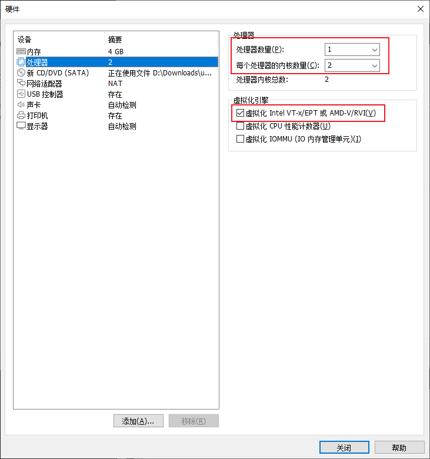
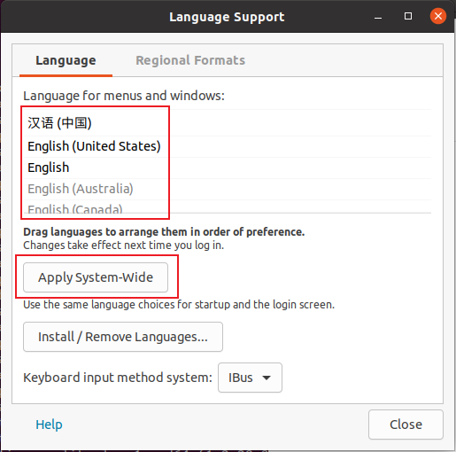

# VMware安装Ubuntu20.04教程

### 安装 Ubuntu

1.下载 Ubuntu Desktop 20.04 LTS 的 ISO 镜像。

2.打开 VMware Workstation ，选择创建新的虚拟机。

3.进入新建虚拟机向导，选择`典型`，点击下一步。

4.选择 Ubuntu 镜像文件。

5.输入全名（稍后将用作虚拟机的计算机名）、用户名和密码。

6.输入虚拟机名称（在 VMware 库中显示的名称）和保存位置。

7.输入虚拟机最大磁盘大小。

8.点击自定义硬件，调整其他设置。

9.推荐将虚拟机配置改为1个处理器、2个内核，内存4GB ，如有其他需求可自行修改。虚拟化引擎中的第一项可提高虚拟机性能，建议开启。

10.（可选）由于 Ubuntu 安装时会联网下载更新，但默认软件源在国内下载速度较慢，因此可以取消勾选网络适配器中的`启动时连接`，以阻止自动下载，提高安装速度，安装完成后可切换至速度较快的软件源并手动安装。

11.配置完成后点击关闭，再点击新建虚拟机向导的完成按钮，即可启动虚拟机并开始安装。安装过程是全自动的，无需操作，等待安装完成即可。

12.出现以下登录界面，即为安装完成，输入之前设置的密码登录。

13.第一次登录时，会询问有关隐私等的选项，如无特殊需求一路点击 Next 即可。

### 基本配置与更换软件源

1.如果安装前断开了虚拟机的网络，在菜单栏点击虚拟机->设置，选择网络适配器，勾选`已连接`和`启动时连接`，即可连接网络。虚拟机右上角出现如图所示的小图标即为连接成功。

2.在桌面按 Ctrl+Alt+T ，打开终端，输入

`sudo gedit /etc/apt/sources.list`

然后输入密码，即可编辑软件源。输入密码时终端不会有任何提示，这是为了防止泄露密码长度，直接输入后按回车即可。

3.点击右上角的菜单键，选择 Find and Replace ，将所有的`deb http://us.archive.ubuntu.com/ubuntu/` 替换为 `deb http://mirrors.sdu.edu.cn/ubuntu/`。完成后点击 Save 保存，关闭窗口。

4.在终端输入 `sudo apt update` 和 `sudo apt upgrade` ，体验镜像站的校内速度并更新软件。可能需要输入 `y`并按回车以确认安装。

5.更新完成后， 在终端输入 `sudo apt install open-vm-tools`，安装完成后可在虚拟机内外共享剪贴板及自动调整虚拟机分辨率。

### 更改语言和时区

1.点击右上角的电源按钮，选择 Settings ，选择左侧的 Region & Language 。

2.点击 Manage Installed Languages ，会提示英文语言包不完整，点击 Remind Me Later 。

3.点击 Install / Remove Languages... ，选中`Chinese (simplified)`，点击 Apply ，输入密码，等待安装完成。

4.将 Language for menus and windows 中的`汉语（中国）`拖动到最上方，然后点击 Apply System-Wide 。

5.选择 Regional Formats ，调整为`汉语（中国）`，点击 Apply System-wide 。完成后关闭窗口。

6.重启虚拟机，即可看到语言已更改为中文。登录后会询问是否将主文件夹下的文件夹更改为中文名称，随意选择即可。

7.再次进入设置，选择左侧的日期和时间，将时区更改为 `UTC+08` 。（直接在地图上选择位置）

8.设置完成，现在可以愉快地体验 Ubuntu 了~

