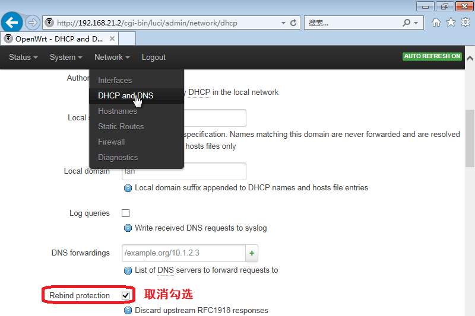

---
title:校内用户必看：路由器关闭 Rebind Protection
date: "2021-05-12T22:12:03.284Z"
description: ""
tags: ["guide"]
---
# 校内用户必看：路由器关闭 Rebind Protection

## 什么是 Rebind Protection，为什么要关闭它？

dnsmasq 提供了名为 rebind protection 的功能，意思是，当上游 DNS 返回了私有 IP 解析结果时，认为遭到了 DNS 劫持，从而拒绝此结果，以 NXDOMAIN 取代之。
然而，山东大学的校园网已经将私有 IPv4 网段作为了校园网的一部分，`10.0.0.0/8` `172.16.0.0/12` `192.168.0.0/16` 均被使用，以前两者尤甚。本镜像站所用服务器也使用了内网地址。因此，对应域名的 A 记录不可避免地要设置为私有 IP。
dnsmasq 默认不开启 rebind protection 功能，但官方版本的 OpenWRT 默认开启。如果你的路由器是基于 OpenWRT 的发行版，则需要手动关闭此功能。

注意，我们仅推荐在山东大学校园网环境下关闭此功能。对于其他网络环境，应具体情况具体分析。

## 如何确定是否需要关闭此功能？

- 在山东大学校园网环境下，如果出现浏览器不能访问 `mirrors.sdu.edu.cn` ，但可以访问 `10.102.32.195`（即前述域名对应的 A 记录）的情况，则表示当前 rebind protection 已经开启，需要关闭此功能。

- 在山东大学校园网环境下，使用 `nslookup`、`dig` 等工具取得 `mirrors.sdu.edu.cn` 的 A 记录，结果为空，也表示当前 rebind protection 已经开启，需要关闭此功能。

## 如何关闭此功能？

对于官方版本的 OpenWRT，可参考下图。即，选择 `网络` → `DHCP/DNS`  菜单，找到 `重绑定保护`，取消勾选这个选项。最后，别忘了点击 `保存&应用` 按钮。

一般而言，到此就结束了。

## 提示

如果路由器并未使用官方版本的 OpenWRT，也无法从设置界面中找到类似的设置，则可能无法从 Web 界面完成这个操作。此时，可以通过 SSH 连接到路由器，然后使用 `uci` 命令或者修改 `/etc/config/dhcp` 文件来达到目标。

如果依然无法完成此操作，或者路由器并不基于 OpenWRT，但依然存在 rebind protection 问题，可将电脑端的 DNS 设置为非路由器 DNS 来直接绕过 rebind protection。注意，并非所有路由器都会允许底下的设备走第三方 DNS，有些路由器会通过 DNS 劫持的手段强制返回路由器 DNS 的结果。

如果依然无法完成此操作，可考虑直接连接到山东大学校园网。
